# GroupProject1
Matt, Andres, Travis

---
## SPY during epidemic time periods:

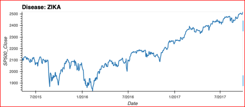

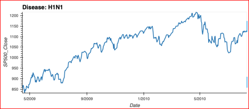

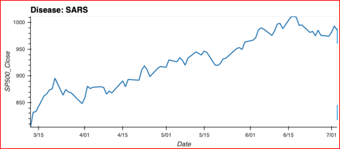

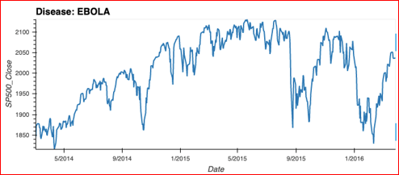

---

## Breaking down the SPY into sectors 
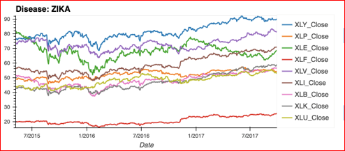

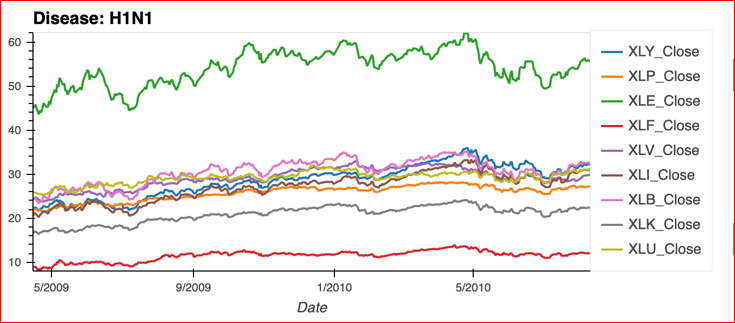

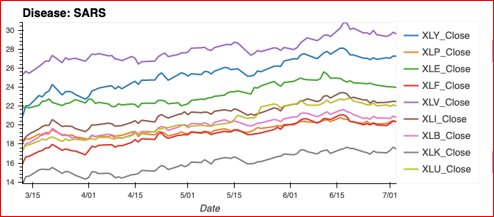

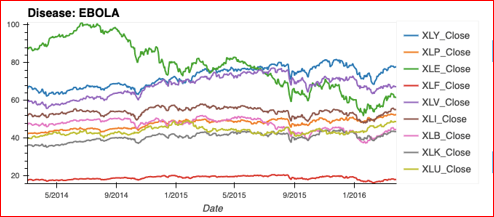

---

## Inspecting Gold during epidemic time periods:
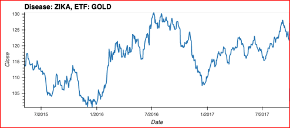

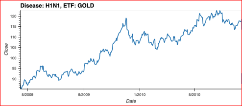

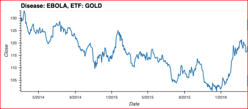

---

## Treasury Bonds during the epidemics:
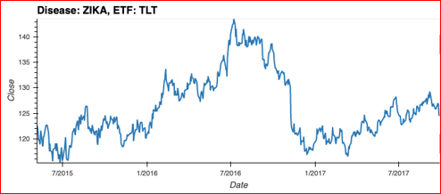

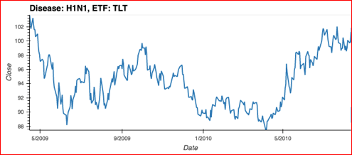

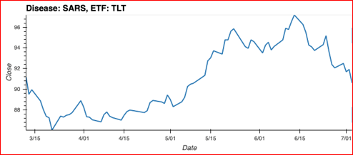

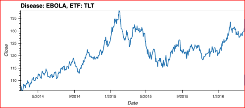

---

## Inspecting tranches for each disease:

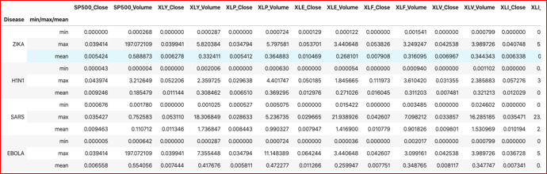

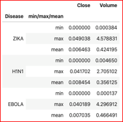

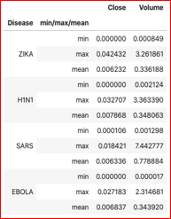

---

## Calculating volatility of markets during epidemic time periods:
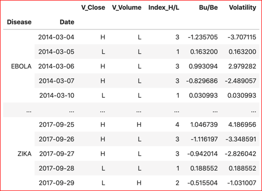

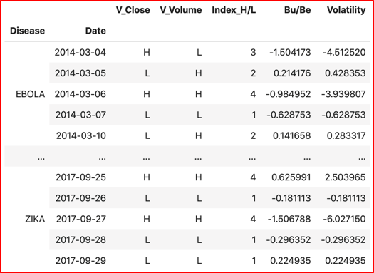

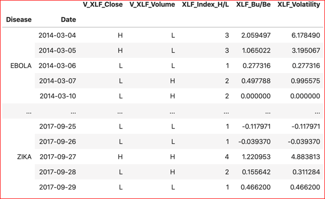

---

## Inspecting volatility of Gold during epidemic time periods:

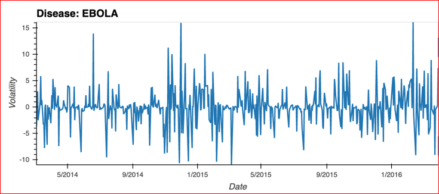

---

## Inspecting volatility of Treasury Bonds during epidemic time periods:
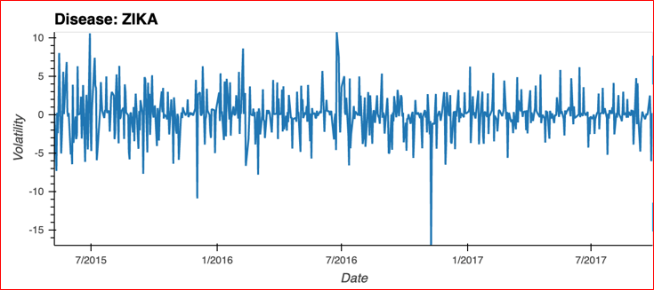

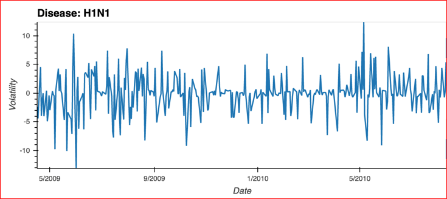

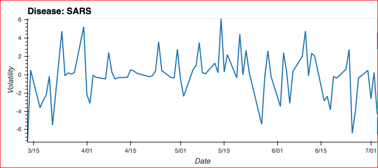

---

## Inspecting volatility of SPY and Sectors during epidemic time periods:

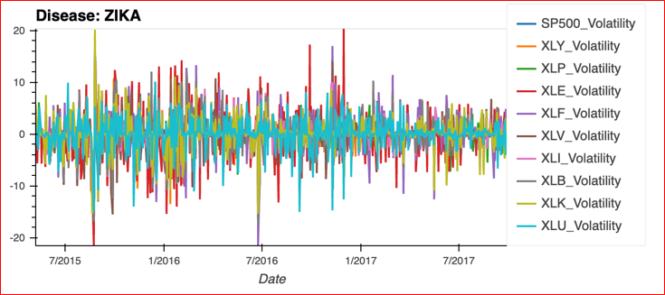

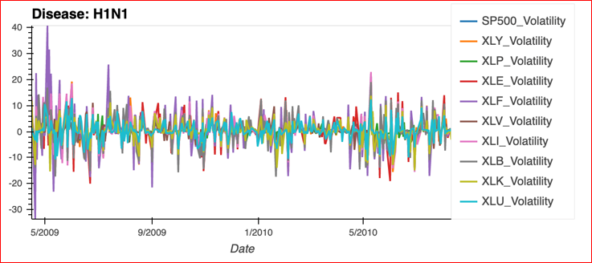

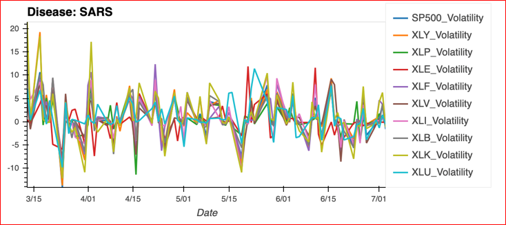

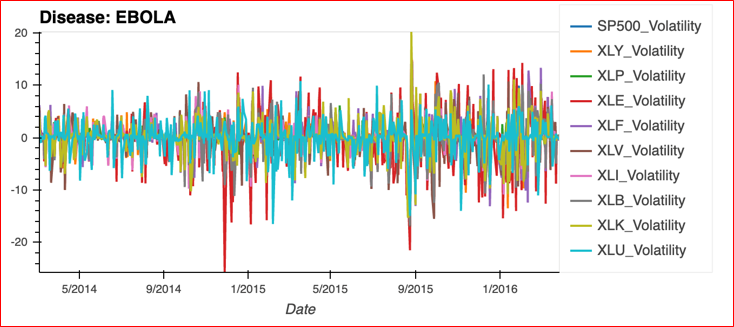

---

